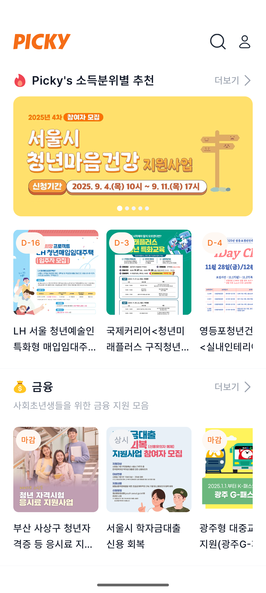
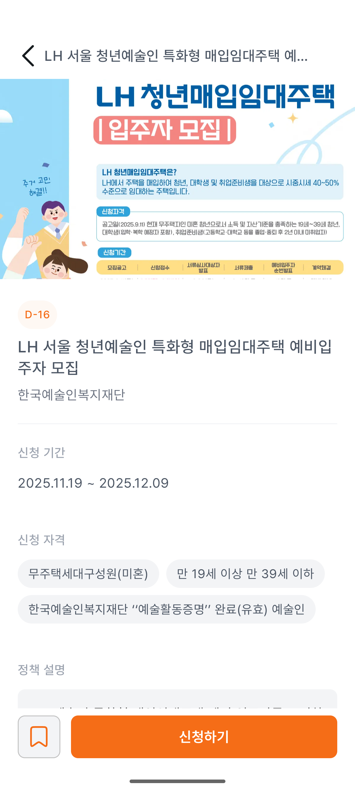
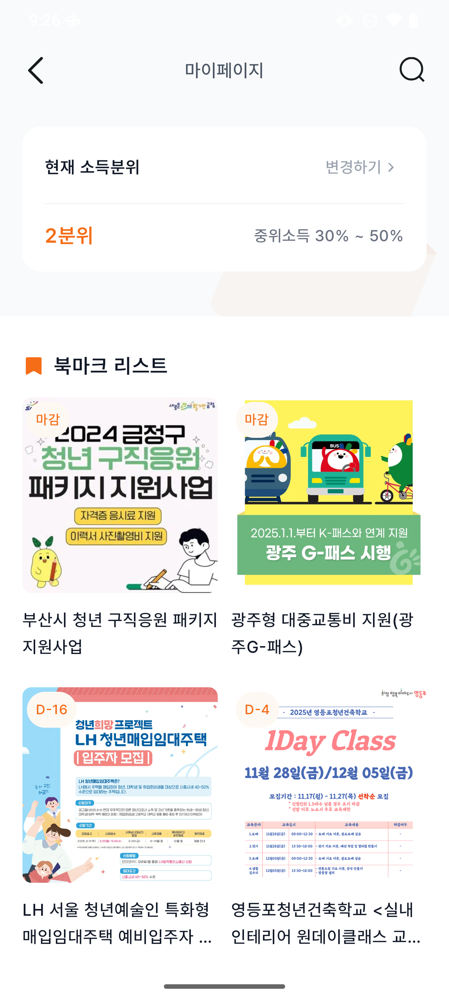
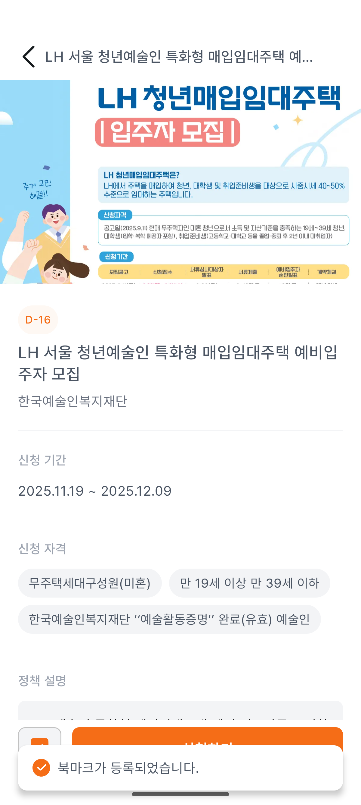

# 🎯 Picky - 청년 정책 아카이빙 플랫폼

> 청년들을 위한 맞춤형 정책 정보를 한눈에 찾아보세요.

## 📱 프로젝트 소개

이 프로젝트는 9th Ne(O)rdinary Hackathon에서 시작된 청년 정책 아카이빙 플랫폼입니다.<br>

복잡하고 흩어져 있는 청년 정책 정보를 한 곳에 모아 제공하고,<br>

사용자의 관심사와 상황에 맞는 맞춤형 정책을 추천하여<br>

청년들이 정부 지원 혜택을 놓치지 않고 활용할 수 있도록 돕습니다.<br>

## 🗓️ 개발 기간

2025.11.22 – 2025.11.23

## ✨ 주요 기능

### 🏠 홈

- **맞춤형 정책 추천**: 사용자 프로필 기반 정책 큐레이션

- **카테고리별 정책 탐색**: 직관적인 카드 기반 UI

- **실시간 업데이트**: 최신 정책 정보 자동 반영

- **빠른 북마크**: 관심 정책 원터치 저장

### 🔍 검색

- **통합 검색**: 정책명, 키워드, 카테고리별 검색

- **필터링**:

  - 인기순 / 최신순

### 📋 정책 상세

- **상세 정보 제공**: 

  - 정책 개요 및 지원 내용

  - 신청 자격 및 조건

  - 신청 방법 및 기간

  - 정책 설명

  - 신청 링크

- **웹뷰 연동**: 공식 정책 페이지 바로가기

- **북마크 기능**: 관심 정책 저장

### 👤 마이페이지

- **북마크 관리**: 저장한 정책 모아보기

- **프로필 관리**: 소득분위 설정

## 🛠 기술 스택

### Android

- **Kotlin**: 주요 개발 언어

- **Jetpack Compose**: 선언형 UI 프레임워크

- **Material Design 3**: 최신 디자인 시스템

### 아키텍처 & 라이브러리

- **멀티 모듈 아키텍처**: 기능별 모듈 분리로 확장성 및 유지보수성 향상

- **MVVM 패턴**: 관심사의 분리를 통한 유지보수성 향상

- **Hilt**: 의존성 주입 (Dependency Injection)

- **Retrofit**: REST API 통신

- **Navigation Component**: 화면 전환 관리

- **StateFlow**: 반응형 상태 관리

- **Kotlin Coroutines**: 비동기 처리

### UI/UX

- **커스텀 디자인 시스템**: 일관된 사용자 경험을 위한 공통 컴포넌트

- **반응형 디자인**: 다양한 화면 크기 지원

- **직관적인 네비게이션**: 하단 탭 바를 통한 주요 기능 접근

## 🏗 프로젝트 구조

```
picky-android/
├── app/                           # 애플리케이션 모듈
├── build-logic/                   # 빌드 설정 로직
│   └── convention/                # 컨벤션 플러그인
├── core/                          # 핵심 공통 모듈
│   ├── data/                      # 데이터 레이어
│   │   ├── model/                 # 데이터 엔티티
│   │   ├── mapper/                # 데이터 변환
│   │   └── repo/                  # 레포지토리 구현
│   ├── designsystem/              # 디자인 시스템
│   │   ├── common/                # 공통 UI 컴포넌트
│   │   └── theme/                 # 테마 및 스타일
│   ├── local/                     # 로컬 데이터 소스
│   ├── model/                     # 공통 도메인 모델
│   ├── navigation/                # 네비게이션 로직
│   └── network/                   # 네트워크 레이어
│       ├── api/                   # API 인터페이스
│       ├── datasource/            # 원격 데이터 소스
│       └── model/                 # 네트워크 응답 모델
└── feature/                       # 기능별 모듈
    ├── main/                      # 메인 화면 (네비게이션)
    ├── auth/                      # 인증 (로그인/회원가입)
    ├── home/                      # 홈 화면
    ├── search/                    # 검색 화면
    └── mypage/                    # 마이페이지
```

### 모듈 구조 상세

#### Core 모듈
- **data**: 데이터 레이어 구현체 (Repository Pattern)
- **designsystem**: 재사용 가능한 UI 컴포넌트 및 테마
- **local**: 로컬 데이터베이스 및 캐싱
- **model**: 애플리케이션 전반에서 사용되는 공통 모델
- **navigation**: 화면 전환 및 딥링크 처리
- **network**: Retrofit 기반 네트워크 통신

#### Feature 모듈
- 각 기능을 독립적인 모듈로 분리
- Screen, ViewModel, Component로 구성
- 단일 책임 원칙에 따른 모듈 설계

## 📸 스크린샷

### 주요 화면

<div align="center">

  

  

  

  

  

</div>

<div align="center">

  <strong>스플래시</strong> | <strong>홈</strong> | <strong>정책 상세</strong> | <strong>마이페이지</strong> | <strong>북마크</strong>

</div>

### [DEMO](https://youtube.com/shorts/2zEg4XMvfBQ?feature=share)
